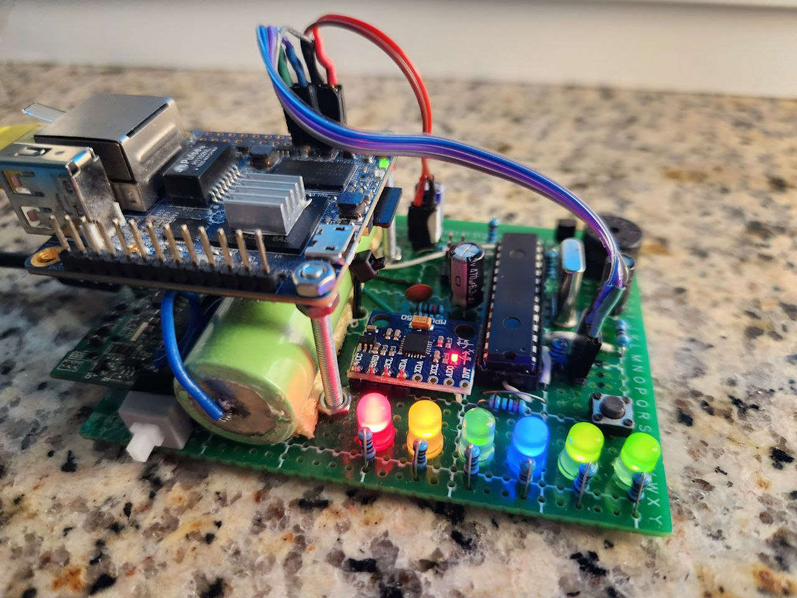
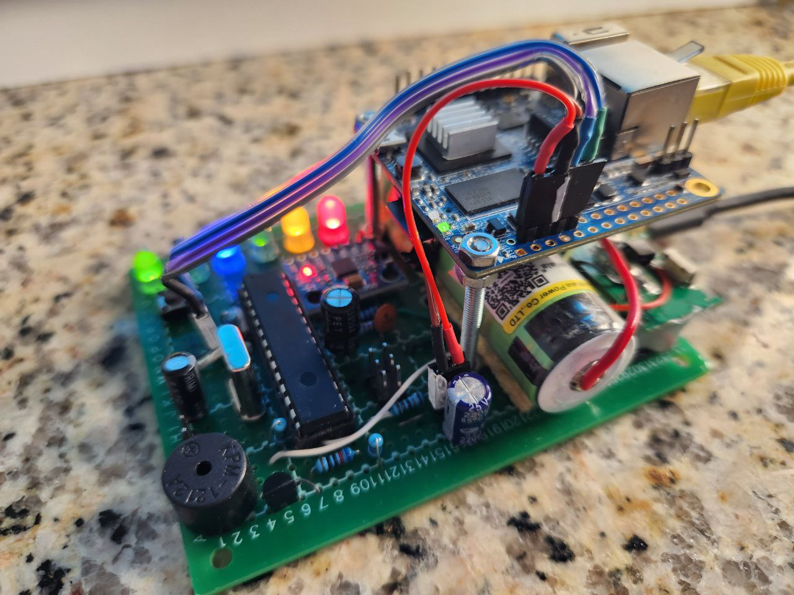
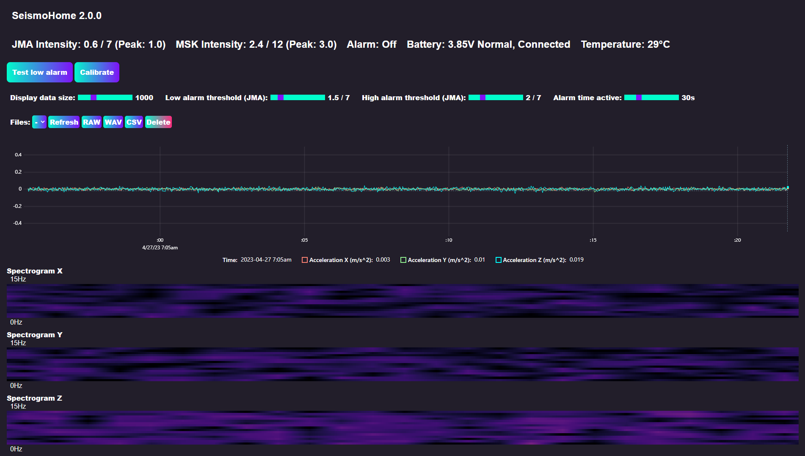
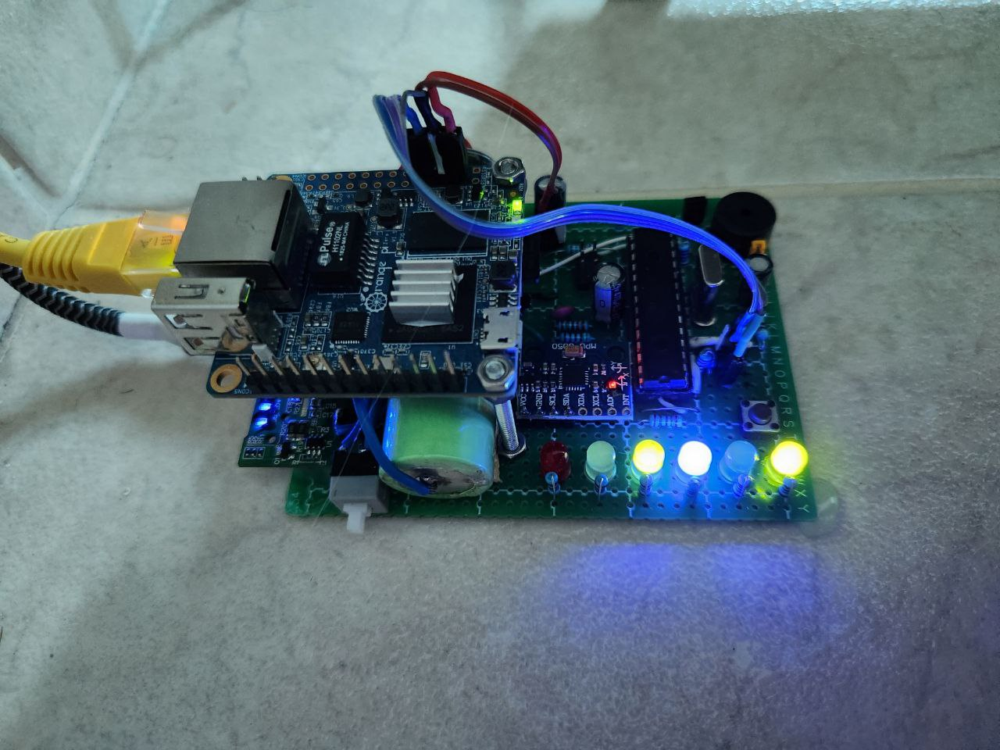

# SeismoHome
## Simple MPU-6050 based earthquake detector with alarm, uninterruptible power supply, data logging and web interface

   

      
      
      
   

   
   

   

----------

## What is it and how does it work?

SeismoHome is a home seismometer / seismograph project capable of recording acceleration data and determining the intensity of an earthquake to trigger an alarm.
Also, there is a web page that displays current data, including accelerations on all 3 axes and spectrograms (FFT) for each axis. Also, on this page you can download (in RAW / WAV or CSV format) / delete data files, set alarm thresholds and time, and test the alarm in two modes (low ang high).

The main part of the seismometer is the popular MPU-6050 IMU, operating in +/-2g mode (the most sensitive mode) and updating data 40 times per second (with a low-pass filter set to ~20Hz).
Together with further software filters, the range of the seismograph is 0.1-15Hz.

The IMU is connected to an Atmega328P (Arduino) which handles receiving data from the IMU, managing battery charging, measuring other data, and communicating with the main data handler (Python script) using UART

----------

## Dependencies

- **Flask**: https://github.com/pallets/flask
- **numpy**: https://github.com/numpy/numpy
- **pyserial**: https://github.com/pyserial/pyserial
- **TimerOne**: https://github.com/PaulStoffregen/TimerOne
- **imerTwo**: https://github.com/theAndreas/TimerTwo

----------

## Get started

1. Find all the necessary components and assemble a seismograph =) *(if you want me to make a schematic and instructions, open an issue, because I doubt that this project will be of interest to anyone)*
2. Download PlatformIO source code and upload it to your MCU (you can simply rename src/main.cpp to main.ino and use Arduino IDE for it)
3. Attach the seismograph securely. Best of all - stick to the floor in a room where people walk the least. An example in the photo below

4. Download release (or clone repo, install all requirements from requirements.txt)
5. For linux, copy `seismohome.service` to `/etc/systemd/system/` and edit `WorkingDirectory` and `ExecStart`. Reload systemd daemon (`sudo systemctl daemon-reload`), enable service on boot (`sudo systemctl enable seismohome`) and start it (`sudo systemctl start seismohome`).
6. Make sure all working correctly (ADC LED should blink) and open web page
7. Set thresholds to high values, wait for an hour or more and write down maximum intensity (This will be the intensity of the noise). Next, set this intensity as the threshold for low alarm mode, and for high add 1 (For example 1.5 and 2 JMA)

If you want more detailed instructions, please open an issue. If I understand that someone has an interest in the project, I will make more detailed instructions and even a schematic.
